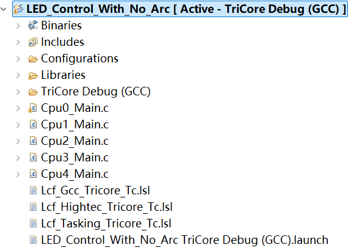

# Arc1 C 程序代码对应的硬件说明

## 硬件架构图

## 关键组件说明

**处理器（CPU）**

- 型号：`IFX TC499`
- 功能：负责执行 Arc1 C 程序的核心逻辑。

## 备注

- 适合 IFX 开发板，型号为：TriBoard TC4X9 STD V1.1 TBAEK8FQ
- 使用 IFX 配套工具套装：AURIX Development Studio
- 在 ADS 中对应软件工程结构如下：
  
