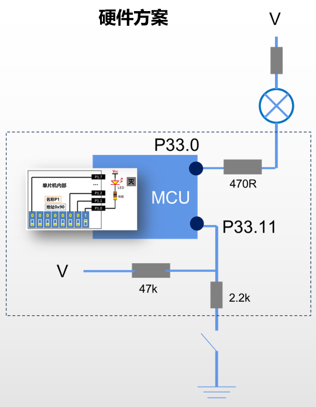
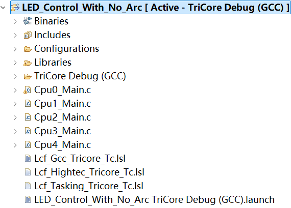

# Arc1 C 程序代码对应的硬件说明

## 硬件架构图

## 关键组件说明

**处理器（CPU）**

- 型号：`IFX TC499`
- 功能：负责执行 Arc1 C 程序的核心逻辑。

## 备注

- 适合 IFX 开发板，型号为：TriBoard TC4X9 STD V1.1 TBAEK8FQ
- 使用 IFX 配套工具套装：AURIX Development Studio
- -https://community.infineon.com/t5/%E5%8D%9A%E5%AE%A2/AURIX-TC4x-%E5%8D%95%E7%89%87%E6%9C%BA%E5%85%A5%E9%97%A8-%E5%9C%A8%E5%85%8D%E8%B4%B9%E7%9A%84-ADS-Limited-%E5%BC%80%E5%8F%91%E5%B9%B3%E5%8F%B0%E4%B8%8A%E5%AE%9E%E7%8E%B0-Blinky-LED-%E7%A4%BA%E4%BE%8B%E4%BB%A3%E7%A0%81/ba-p/971065
-
- 在 ADS 中对应软件工程结构如下：

  
