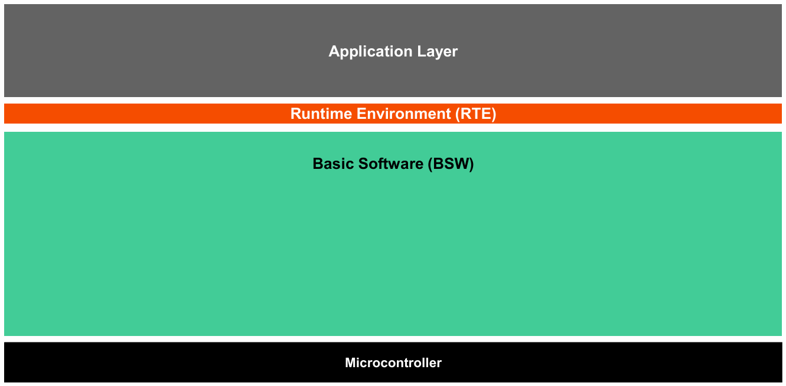
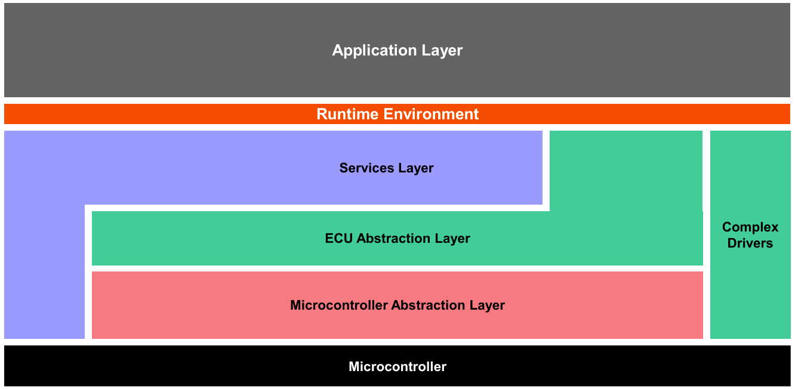
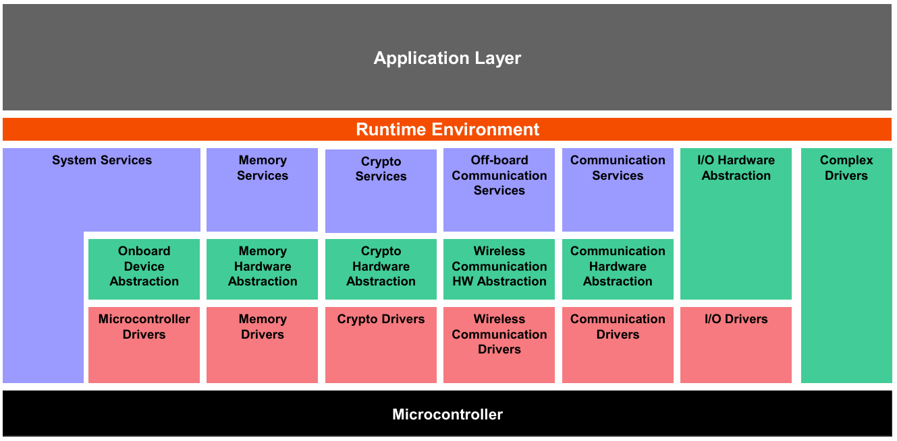
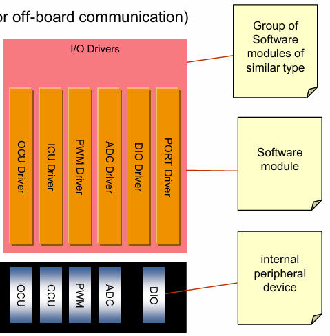

# Arc3 C 程序代码对应的架构策略说明

## 外部系统变化时，软件开始需要架构策略

### 关注应对硬件的变化：

此处提到的硬件变化，是指 MCU 选型的变化，外设功能适配的变化，以及 MCU 引脚 PIN 的分配变化这三个关键维度。
以上三处的变化都会引发如下两个维度的变点：

1. 驱动库函数（如 MCAL）会因为供应商的改变而引发接口函数的变化；
2. Port-PIN 配置的变化（选择哪个 MCU PIN 引脚；适配哪个 MCU 外设功能）

> 补充说明：引脚复用是 MCU 硬件的 “刚需设计”
> MCU 的芯片面积、引脚数量是有限的，但外设功能（GPIO、ADC、SPI 等）需求越来越多 —— 为了在有限引脚下支持更多功能，MCU 厂商必然采用 “引脚复用” 设计（一个 Pin 关联多个外设模块，通过配置寄存器选择激活的功能）。

所以，为了应对硬件的变化，软件架构设计需要考虑隔离相关变点（关注点分离，抽象与封装）

- “引脚配置的集中初始化”
- 根据配置表，批量初始化多个引脚的功能模式和驱动特性

### 参考 AUTOSAR 设计思想与规范进行 Arc3 设计：

#### AUTOSAR 分层思想与概念

The AUTOSAR Architecture distinguishes on the highest abstraction level between three
software layers: Application, Runtime Environment and Basic Software which run on a
Microcontroller.



The AUTOSAR Basic Software is further divided in the layers: Services, ECU Abstraction,
Microcontroller Abstraction and Complex Drivers.



The Basic Software Layers are further divided into functional groups. Examples of Services
are System, Memory and Communication Services



#### AUTOSAR MCAL IO 设计思想与规范




AUTOSAR MCAL 层设计的 3 个核心思想：
（背景说明：汽车电子相关 MCU 的引脚复用是硬件设计的必然选择，AUTOSAR 是对这一硬件共性的软件标准化。AUTOSAR 成为行业标准后，开始反向影响 MCU 的硬件设计，形成 “硬件适配软件标准，软件标准引导硬件优化” 的循环）

1. 主张 “关注点分离”：PORT 负责 “硬件配置”，DIO 负责 “功能操作”
   PORT Driver 只做 “让引脚具备某种功能（如 GPIO）” 的硬件配置，不参与功能的实际使用；
   DIO Driver 只做 “已配置为 GPIO 的引脚” 的数字 I/O 操作，不涉及硬件配置；
   → 这种分离让硬件配置与功能操作解耦：修改硬件引脚配置只需改 PORT Driver，修改 I/O 功能逻辑只需改 DIO Driver。
2. 主张 “硬件抽象”：通过 MCAL 层屏蔽硬件细节
   上层软件（如应用层）不需要直接操作硬件寄存器，只需调用 PORT/DIO Driver 的抽象接口（如 PORT_Init、DIO_WriteChannel）→ MCAL 层承担了 “硬件与上层软件的隔离”，让上层软件不依赖具体 MCU 的硬件设计，提升可移植性。
3. 主张 “分层架构”：明确 MCAL 层的职责边界
   截图用虚线框出了 PORT Driver 的范围，同时区分了 “硬件抽象软件 →MCAL 层 → 片内寄存器 → 硬件” 的层级：
   每一层只与相邻层交互，避免跨层依赖；
   PORT 与 DIO Driver 在 MCAL 层内分工明确，共同完成 I/O 功能的 “配置 + 使用” 闭环。

> 这种架构是为了满足汽车电子软件的 **“可移植性、可维护性、可靠性”** 要求：
> 可移植性：上层软件依赖 MCAL 的抽象接口，换 MCU 只需替换 MCAL 层的 PORT/DIO Driver，上层代码无需修改；
> 可维护性：硬件配置与功能操作分离，修改硬件或功能时只需调整对应层的代码，不影响其他部分；
> 可靠性：分层架构让职责边界清晰，降低了代码耦合，减少了 bug 的扩散范围。

#### Arc3 的关键设计：参考 AUTOSAR MCAL 进行分层分模块设计（Port & Dio）

通过 “Port_cfg 配置硬件 + Dio 操作功能 + LED 应用逻辑” 的分层设计，实现 “硬件抽象” 与 “功能复用”，同时明确 MCAL 层与 LED 层的职责边界。

> 设计结构如下：
>
> | 分层     | 分模块     | 职责说明                                               |
> | -------- | ---------- | ------------------------------------------------------ |
> | MCAL     | port_cfg   | 引脚配置以及外设功能与引脚匹配配置 port-pin mapping    |
> | MCAL     | dio        | IO 驱动抽象接口设计，隔离驱动库函数                    |
> | LED      | led_ctrl   | LED 控制逻辑与规则                                     |
> | 主调度层 | core0_main | 系统初始化与调度，主循环调度（应用实现的任务集成管理） |

> 补充说明：AUTOSAR 规范中，应用层模块（如 LED 控制模块）必须是 “自治的”—— 即模块需包含自身的初始化、运行、销毁逻辑，系统集成层仅负责调用模块的标准化接口，而非介入模块的业务细节。

### 总结：

- 若 LED / 按键引脚变更：仅修改 port_cfg.h 中的 LED1_PORT/PIN、BUTTON_PORT/PIN，其余代码无需改动；
- 若切换控制模式：修改 led_ctrl.h 中的 LED_CTL_TYPE（0 = 常亮，1 = 闪烁）；
- 若迁移到其他 AUTOSAR 兼容 MCU：仅需修改 port_cfg.c（Port 驱动实现）和 dio.c（转换函数），上层业务逻辑完全复用。

- 彻底解耦：上层（主函数 / 业务逻辑）无任何 IfxPort.h 依赖，底层硬件变更不影响上层；
- 性能最优：转换函数采用 static inline，编译后无函数调用开销，等同于宏定义；
- 类型安全：自定义 Dio_StateType 枚举，编译器严格校验，避免非法电平值；
- 符合 AUTOSAR：严格遵循 “Port 配置硬件、DIO 操作功能、应用层实现业务” 的分层职责。

> 补充说明：单独拆分 dio_types.h 的核心目标是：让 “类型定义” 与 “接口声明” 解耦，最小化上层模块的依赖范围，同时适配 AUTOSAR 对 “MCAL 层类型标准化” 的要求。如果把类型直接写入 dio.h，会导致上层模块 “被迫依赖不必要的接口声明”，违背 “最小依赖原则”。SOLID 中的接口隔离原则（Interface Segregation Principle）核心是：
> 客户端不应该依赖它不需要的接口；类之间的依赖应该建立在最小的接口上。
> 这里的 “接口” 不只是 C 语言中的函数接口，还包括头文件暴露的 “抽象契约”（类型、宏、函数声明的集合）；“客户端” 就是引用头文件的上层模块（如 led_ctrl.c、state_monitor.c）。

> 假设我们将 Dio_StateType 直接写入 dio.h，代码如下：

```c
// 混写后的dio.h
#ifndef DIO_H
#define DIO_H

// 类型+接口混写
typedef enum
{
    DIO_STATE_LOW  = 0U,
    DIO_STATE_HIGH = 1U
} Dio_StateType;

#include "port_cfg.h"
void Dio_WritePin(Ifx_P *port, uint8_t pin, Dio_StateType state);
Dio_StateType Dio_ReadPin(Ifx_P *port, uint8_t pin);

#endif /* DIO_H */
```

> 此时会出现 3 个核心问题：

> 1. 依赖膨胀：上层模块仅需 Dio_StateType 时，必须包含 dio.h，进而间接包含 port_cfg.h（引脚宏定义），导致 “类型依赖” 变成 “接口 + 硬件配置依赖”；
> 2. 编译效率低：dio.h 的任何变更（比如接口参数调整），都会让所有引用 Dio_StateType 的模块重新编译；
> 3. 不符合 AUTOSAR 规范：无法对接 AUTOSAR 工具链，也不符合行业通用的 MCAL 代码结构，不利于团队协作（其他开发者需重新适应非标准结构）。
