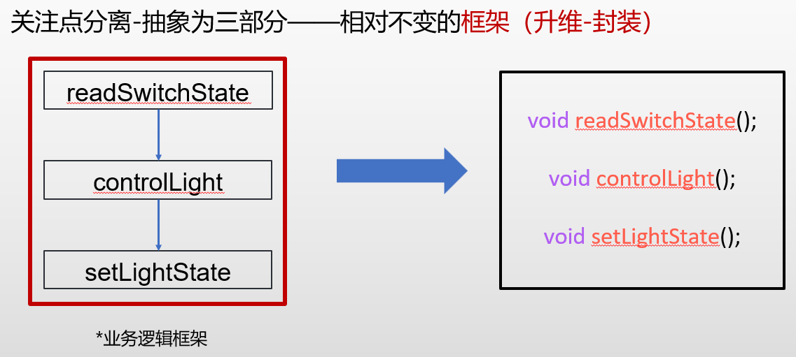
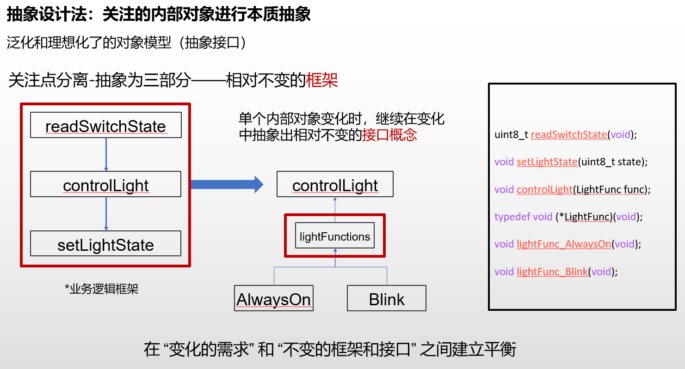
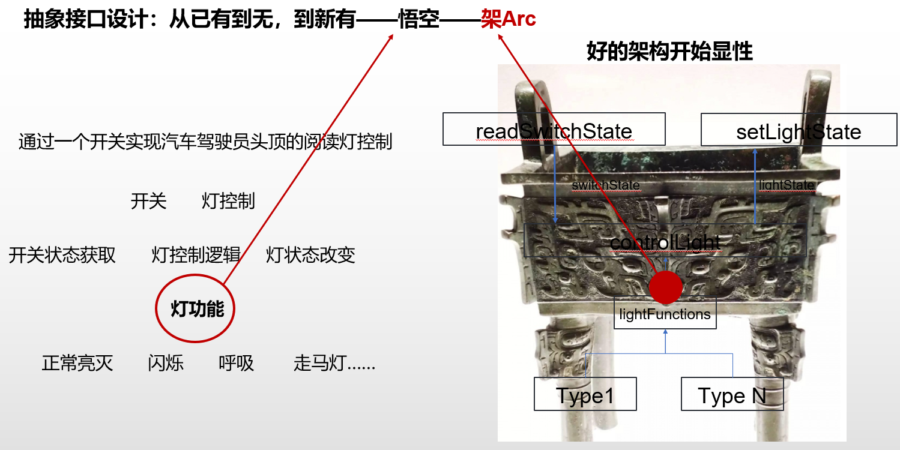

# Arc4 C 程序代码对应的架构策略说明

## 外部系统变化时，软件开始需要架构策略

### 关注应对应用策略的变化

- 应用策略变化：应用策略的变化会引发应用层的变化，如用户需求的变化、功能的增加、优化等。

> 针对 LED 层，可以进一步进行好的架构设计，如继续分层，分模块，且考虑抽象接口的设计，确保 SOLID 原则的应用，尤其是实现最终的开闭原则的目的。
> 其实 MCAL 层里的中间层 DIO 也可以进一步优化设计，考虑抽象接口的设计，确保 SOLID 原则的应用，尤其是实现最终的开闭原则的目的。



> 在以上基础上，进一步利用抽象能力进行抽象接口的设计



> 以此，好的架构设计开始显性



> 具体的软件架构对应文件结构设计如下：
>
> ```
>  LED/
>  ├── dd/ // Driver Dependency（驱动依赖抽象层：封装 DIO 接口）
>  │ ├── led_dd.c
>  │ └── led_dd.h
>  ├── fun/ // Function（行为层：具体灯效实现）
>  │ ├── alwayson.c
>  │ ├── alwayson.h
>  │ ├── blink.c
>  │ ├── blink.h
>  │ └── lightfun.h // 行为抽象接口
>  └── ctrl/ // Control（控制层：核心控制逻辑）
>    ├── led_ctrl.c
>    └── led_ctrl.h
> ```
>
> 结构设计原因：
>
> - 按 “职责分层”：dd 层封装硬件依赖、fun 层实现灯效、ctrl 层实现控制逻辑，符合 “单一职责原则”；
> - 支持 “开闭原则”：新增灯效只需在 fun 层加文件，无需修改 ctrl/dd 层；
> - 易维护：不同职责的代码按文件夹隔离，团队协作时分工更清晰。

```

```
