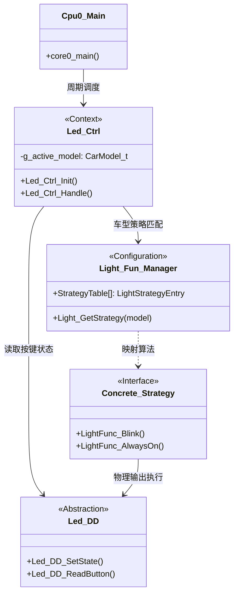

# 基于 IFX TC4X9 的 LED 灯光系统软件架构设计说明书

## 1. 软件架构视图 (UML)

本设计采用**策略模式 (Strategy Pattern)** 结合 **表驱动注册机制**。其核心目标是实现“车型逻辑”与“业务引擎”的完全解耦。

### 1.1 静态架构视图 (Class Diagram)

展示系统如何通过抽象接口屏蔽具体车型和灯效算法的差异。

```mermaid
classDiagram
    class Cpu0_Main {
        +core0_main()
    }
    class Led_Ctrl {
        <<Context>>
        -g_active_model: CarModel_t
        +Led_Ctrl_Init()
        +Led_Ctrl_Handle()
    }
    class Light_Fun_Manager {
        <<Configuration>>
        +StrategyTable[]: LightStrategyEntry
        +Light_GetStrategy(model)
    }
    class Concrete_Strategy {
        <<Interface>>
        +LightFunc_Blink()
        +LightFunc_AlwaysOn()
    }
    class Led_DD {
        <<Abstraction>>
        +Led_DD_SetState()
        +Led_DD_ReadButton()
    }

    Cpu0_Main --> Led_Ctrl : 周期调度
    Led_Ctrl --> Light_Fun_Manager : 车型策略匹配
    Led_Ctrl --> Led_DD : 读取按键状态
    Light_Fun_Manager ..> Concrete_Strategy : 映射算法
    Concrete_Strategy --> Led_DD : 物理输出执行
```
