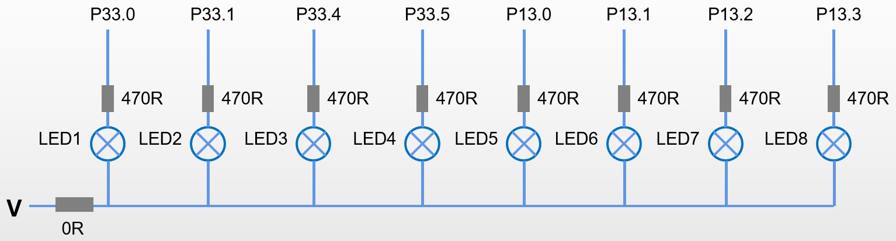

# Arc5 C 程序代码对应的架构策略说明

## 业务逻辑复杂度变化，即 “复杂 LED 控制场景” 下的架构变化

> 当 LED 数量增加、灯效逻辑复杂时，纯嵌入式思维（直接操作硬件引脚）会遇到明显痛点：
> 代码冗余：
> 控制 N 个 LED 需要写 N 次 Dio_WritePin，新增灯效需要重复写硬件控制逻辑；
> 而用向量抽象后，只需写一次 “向量 → 硬件状态” 的映射函数，所有灯效都基于向量运算，代码复用性极大提升。
> 灯效逻辑与硬件耦合：
> 若 LED 引脚变更，所有灯效代码都需要修改（例如把 LED1 改为 LED2）；
> 而向量抽象后，引脚变更只需修改 “向量 → 硬件” 的映射层，灯效逻辑完全不变。
> 复杂灯效难以维护：
> 例如 “LED 矩阵的动态图案”（如汽车尾灯的流水转向、呼吸警示），纯嵌入式思维需要写大量条件判断 / 循环，代码可读性差；

- 应用层架构变化：应用层架构的变化会引发应用层的变化，如应用层的模块划分、功能的增加、优化等。
- 可用 “数据抽象” 解耦 “硬件控制” 与 “灯效逻辑”，LED 的亮灭本质是 “状态数据”（0/1），而灯效是 “状态数据的动态变化”。

### 把 “LED 组” 抽象为 \*\*“状态向量 / 矩阵”，把 “灯效” 抽象为“向量运算”

> LED 组 → 状态向量：
> 多个 LED 的状态可以用一个数组（向量）表示，例如：

```
LED组 = [DIO_STATE_LOW, DIO_STATE_HIGH, DIO_STATE_LOW]  // 对应3个LED的亮/灭

```

这一抽象完全屏蔽了 “硬件引脚” 的细节，灯效逻辑只需操作这个向量，无需关心具体是哪个引脚。

> 灯效 → 向量运算：
> 灯效的本质是 “状态向量的变化规则”：
> 闪烁：向量中所有元素周期性取反（相当于 “向量与全 1 向量异或”）；
> 流水灯：向量中 “1” 的位置周期性平移（相当于 “向量的循环移位运算”）；
> 呼吸灯：向量元素按亮度等级渐变（相当于 “向量与亮度系数相乘”）。
> 这种抽象让灯效逻辑脱离 “硬件控制细节”，变成纯粹的数学运算，开发效率会大幅提升。

这一抽象屏蔽了 “灯效逻辑” 的具体实现细节，只需要定义 “向量运算” 的规则，灯效逻辑只需调用这个规则即可。

> 这个思路的价值会随着 LED 数量增加、灯效复杂度提升而显著放大：
> 适用场景：汽车尾灯（多 LED 矩阵）、仪表板指示灯、氛围灯等需要动态复杂灯效的场景；
> 不适用场景：仅控制 1-2 个 LED、灯效简单（如单灯常亮 / 闪烁）的场景（此时抽象成本大于收益）。

### 总结：这个思路是 “从‘硬件驱动’到‘数据驱动’” 的升级

- 将嵌入式开发的 “硬件驱动思维” 升级为 “数据驱动思维”—— 这是从 “简单功能实现” 到 “复杂系统设计” 的必经之路：
  合理性：LED 的亮灭本质是状态数据，灯效是数据的动态变化，数学抽象符合问题本质；
  必要性：解决多 LED、复杂灯效场景下的代码冗余、耦合、维护难等痛点；
  价值：让灯效开发从 “硬件操作” 转向 “数据运算”，提升代码复用性、可维护性，同时降低复杂灯效的开发成本。

- 从硬件绑定到数据抽象
  传统的 LED1/LED2 宏定义是 “硬件引脚的别名”，本质是硬件绑定，当 LED 数量增加到 128 或 1024 时，会产生大量重复的宏定义，代码冗余且难以维护。
  例如如下代码：

  ```c

  #define LED1     &MODULE_P33, 0             /* Port pin for the LED     */
  #define LED2     &MODULE_P33, 1             /* Port pin for the LED     */

  ```

- 抽象矩阵的思路是把 “一组 LED” 看作一个状态向量 / 矩阵，灯效逻辑只操作这个抽象数据结构，完全不关心具体的硬件引脚，这是 “数据驱动” 的核心。

  - 当需要扩展 LED 数量（如从 8 个到 1024 个），只需修改矩阵的维度定义，无需修改应用层的灯效算法。
  - 灯效算法可以复用通用的数学运算（如向量移位、矩阵卷积、亮度插值），无需为每个灯效重新编写硬件控制逻辑。
  - 数据驱动的本质是让上层只关注 “数据本身的运算”，不关注数据的 “业务 / 硬件语义”
    - 0 = 灭、1 = 亮是 “业务语义”，完全脱离硬件；
    - 上层只需用数学运算（矩阵加法、乘法来建模）操作 0/1 数组，比如：
    - 这种抽象不仅能支持 8 个 LED，还能无缝扩展到 128、1024 个 LED 的矩阵，甚至可以和计算机视觉、图形学的算法结合（比如用卷积实现动态光斑效果）。
    - 这些运算和硬件无关，是纯数学逻辑，真正实现 “上层做数学，底层做映射”。

- 抽象矩阵作为 “硬件层” 与 “应用层” 的中间层，实现了彻底解耦：
  - 硬件层：负责矩阵状态到物理引脚的映射；
  - 应用层：负责矩阵的数学运算（灯效逻辑）；
  - 任何一层的变更都不会影响另一层，符合开闭原则。

> 把整个 LED 系统拆分为三层：
>
> | 分层   | 职责                              | 关键设计概念                                        |
> | ------ | --------------------------------- | --------------------------------------------------- |
> | 应用层 | 灯效算法实现（纯数学运算）        | LED 状态矩阵 / 向量、灯效算子（如移位、翻转、渐变） |
> | 抽象层 | 管理 LED 矩阵的抽象定义与硬件映射 | ILED 设备描述符、矩阵状态缓冲区                     |
> | 硬件层 | 矩阵状态到物理引脚的刷新          | 引脚映射表、批量刷新函数                            |

#### 数据驱动的本质：要让代码从 “操作硬件” 转向 “操作数据”，第一步就是要把 “LED 亮灭效果” 这个业务问题，翻译成一个纯粹的数学问题。

> 把 LED 灯效彻底转化为纯线性代数问题

1. 基础模型：LED 组 = 一维向量

## 8 个 LED 的状态可以表示为一个 8 维行向量：L=[l1​​l2​​l3​​l4​​l5​​l6​​l7​​l8​​]其中 li​∈{0,1}，0 表示灭，1 表示亮。

$$
    \begin{pmatrix}
    a & b \\
    c & d
    \end{pmatrix}
$$

---

---

# Arc5 C 程序代码对应的硬件说明

## 硬件架构图

> 本案例仅采用 8 个 LED 来模拟表示复杂度不断增加的业务场景。


