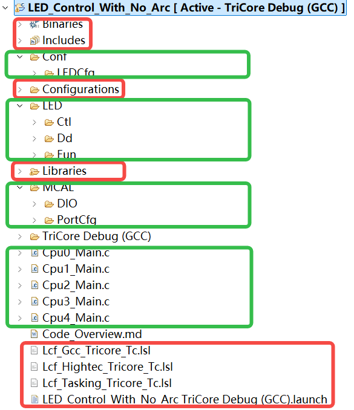

# Arc5 C 程序代码对应的架构策略说明

## 应用部署场景的变化与设计背景

回归系统架构设计层面：多核同构，并行与负载均衡.
针对业务场景复杂化时选择相同控制范式策略，采用多核通信与并行，结合硬件虚拟化技术安全隔离

> 应用场景变化：“LED 系统需支持多灯效并行：① 刹车灯（最高优先级，立即响应）；② 转向灯（中等优先级，50ms 精度）；③ 氛围灯（低优先级，100ms 精度）；④ 所有灯效互不阻塞，且刹车灯可打断其他灯效”。
> 用户场景说明：此时处于转向过程中，转向灯呼吸式闪烁，同时氛围灯工作（循环流水式灯效），然后用户紧急刹车，此时系统应立即响应刹车灯， “刹车灯触发→暂停转向灯→执行刹车灯逻辑”，整个过程氛围灯保持工作，但切换到另外一个灯效模式（氛围灯同时切换为一个五个LED灯一起频闪的状态）。刹车松开后，转向灯继续呼吸、氛围灯回到流水线循环。
> 核心解决思路是 **“核心分工 + 芯片级通信 + 负载均衡”**
>
> Arc5 方案设计核心价值（匹配需求 + 架构升级）
>
> - 实时性保障：多核拆分后，高优先级任务（如紧急刹车灯效）独占核心资源，中断响应从 “毫秒级” 降至 “微秒级”，满足车载场景的功能安全要求（符合 AUTOSAR 功能安全等级）；
> - 并行能力释放：同构多核并行执行不同任务，灯效、外设、中断互不阻塞，支撑 “多灯效 + 多外设” 的复杂场景；
> - 硬件资源最大化利用：TC4 开发板的多核设计本就是为了车载场景的并行处理，Arc5 回归 “系统架构层”，充分发挥芯片硬件能力（而非仅在软件层解耦）；
> - 可扩展性保留：Arc41 的 “配置与业务分离” 仍被保留（如更多灯效配置仍通过led_cfg.c注入），同时新增 “多核相关配置”，符合架构演进的 “兼容式升级” 原则。
>
> 当需求从 “功能扩展” 升级到 “性能 / 安全 / 实时性保障” 时，架构必须从 “软件逻辑层” 回归 “系统硬件层”，这是 Arc41→Arc5 的核心驱动力。

## 剖析理解TC4 CPU多核启动逻辑（结合ADS Demo工程代码分析）

### MCU 的硬件硬连线逻辑（Hard-wired Logic） 和 固件（Firmware）

在英飞凌 TC4 内部，有一个被称为 "Boot ROM" 的区域（也叫固件区）。它是芯片出厂时就固化在硅片里的，不可更改。
TC4 的硬件架构设计决定了“第一枪”打在哪里。链接器（Linker）配合硬件，把 \_START 函数放到了那个位置。

- 硬件指引：当芯片的 PORST（上电复位）引脚接收到电平跳变，或者内部电源稳定后，硬件逻辑会强制 CPU 0 的 PC 指针（Program Counter） 指向一个特定的物理地址（通常是 0x80000000 或 0xAF000000，取决于 Boot Mode 引脚的配置）。

- SSW 的物理位置：在链接脚本（Linker Script）中，Ifx_Ssw_Tc0.c 编译出来的二进制指令被显式地放置在了那个硬件预设的起始地址。

> 上电后，
>
> - T0时刻（硬件自检）：电源控制器稳定电压，逻辑电路解除复位。
> - T1时刻（固件介入）：芯片内部的 BROM（Boot ROM） 运行。它会检查你的 Boot Mode 引脚（HWCFG），看看你是想从 Flash 启动，还是想从串口下载代码。
> - T2时刻（移交指挥权）：如果判定为从 Flash 启动，BROM 会执行跳转指令，直接跳到 Flash 的首地址。
> - T3时刻（SSW运行）：这一跳，就跳到了 Ifx_Ssw_Tc0.c 里的 \_START 入口。

在硅片设计层面，除了 Core 0 之外的其他核，上电后的默认状态被设置为 "Halt"（挂起）。它们就像没有接通电源的灯泡，虽然物理上存在，但在接收到 Core 0 发出的“启动报文”前，它们的 PC 指针是不转动的。为了保证汽车电子的安全性，必须有一个“主责核”来负责扫描系统错误、校验代码签名。Core 0 就是这个法定的“安全官”。

所以：Core 0 执行这份 Ifx_Ssw_Tc0.c，然后

- 1. 扫描系统错误（如内存错误、指令错误）；
- 2. 校验代码签名（如防篡改功能）；
- 3. 启动 Core 1（如果有）等多核的：Ifx_Ssw_TcX.c
- 4. 最后，Ifx*Ssw_jumpToFunction(core0_main); /* Jump to main function of CPU0 \_/，跳转到 Core 0 的用户主函数 core0_main。
- 5. Core 0 进入正常的运行状态。
- 6. 其他核的启动过程类似。

TC4开发板里，IFX给出的多核启动代码段参考如下，通过更改宏定义值，可以禁止对应核心的启动运行。

Ifx_Ssw_Tc0.c代码段示意：

```c
static void __StartUpSoftware_Phase7MulticoreStartup(void)
{
    /* PROT and APU related configurations */
    Ifx_Ssw_AP_Init();

    Ifx_Ssw_Barrier();

    /* Start remaining cores */
#if (IFX_CFG_SSW_ENABLE_TRICORE1 != 0)
    Ifx_Ssw_startCore(&MODULE_CPU1, (unsigned int)__START(1));           /*The status returned by function call is ignored */
#if (IFXCPU_NUM_SAFE_MODULES > 2)
    /* 100uS delay in subsequent CPU start */
    Ifx_Ssw_delay();
#endif /* #if (IFXCPU_NUM_SAFE_MODULES > 2) */
#endif /* #if (IFX_CFG_CPU_CSTART_ENABLE_TRICORE1 != 0)*/

#if (IFXCPU_NUM_SAFE_MODULES > 2)
#if (IFX_CFG_SSW_ENABLE_TRICORE2 != 0)
    Ifx_Ssw_startCore(&MODULE_CPU2, (unsigned int)__START(2));           /*The status returned by function call is ignored */
#if (IFXCPU_NUM_SAFE_MODULES > 3)
    /* 100uS delay in subsequent CPU start */
    Ifx_Ssw_delay();
#endif /* #if (IFXCPU_NUM_SAFE_MODULES > 3) */
#endif /* #if (IFX_CFG_CPU_CSTART_ENABLE_TRICORE2 != 0)*/

#if (IFXCPU_NUM_SAFE_MODULES > 3)
#if (IFX_CFG_SSW_ENABLE_TRICORE3 != 0)
    Ifx_Ssw_startCore(&MODULE_CPU3, (unsigned int)__START(3));           /*The status returned by function call is ignored */
#if (IFXCPU_NUM_SAFE_MODULES > 4)
    /* 100uS delay in subsequent CPU start */
    Ifx_Ssw_delay();
#endif /* #if (IFXCPU_NUM_SAFE_MODULES > 4) */
#endif /* #if (IFX_CFG_CPU_CSTART_ENABLE_TRICORE3 != 0)*/

#if (IFXCPU_NUM_SAFE_MODULES > 4)
#if (IFX_CFG_SSW_ENABLE_TRICORE4 != 0)
    Ifx_Ssw_startCore(&MODULE_CPU4, (unsigned int)__START(4));           /*The status returned by function call is ignored */
    /* 100uS delay in subsequent CPU start */
#if (IFXCPU_NUM_SAFE_MODULES > 5)
    Ifx_Ssw_delay();
#endif /* #if (IFXCPU_NUM_SAFE_MODULES > 5) */
#endif /* #if (IFX_CFG_CPU_CSTART_ENABLE_TRICORE4 != 0)*/

#if (IFXCPU_NUM_SAFE_MODULES > 5)
#if (IFX_CFG_SSW_ENABLE_TRICORE5 != 0)
    Ifx_Ssw_startCore(&MODULE_CPU5, (unsigned int)__START(5));           /*The status returned by function call is ignored */
#endif /* #if (IFX_CFG_CPU_CSTART_ENABLE_TRICORE5 != 0)*/
#endif /* #if (IFXCPU_NUM_SAFE_MODULES > 5) */
#endif /* #if (IFXCPU_NUM_SAFE_MODULES > 4) */
#endif /* #if (IFXCPU_NUM_SAFE_MODULES > 3) */
#endif /* #if (IFXCPU_NUM_SAFE_MODULES > 2) */

    /* CSRM SYNC Point */
    Ifx_Ssw_CsrmSync_D();

    Ifx_Ssw_jumpToFunction(__Core0_start);
}

```

Ifx_Ssw.h代码段示意：

```c

#ifndef IFX_CFG_SSW_ENABLE_TRICORE0
#define IFX_CFG_SSW_ENABLE_TRICORE0 (1U)
#endif

#ifndef IFX_CFG_SSW_ENABLE_TRICORE1
#define IFX_CFG_SSW_ENABLE_TRICORE1 (1U)
#endif

#if (IFXCPU_NUM_SAFE_MODULES > 2)
#ifndef IFX_CFG_SSW_ENABLE_TRICORE2
#define IFX_CFG_SSW_ENABLE_TRICORE2 (1U)
#endif
#endif /* #if (IFXCPU_NUM_SAFE_MODULES > 2) */

#if (IFXCPU_NUM_SAFE_MODULES > 3)
#ifndef IFX_CFG_SSW_ENABLE_TRICORE3
#define IFX_CFG_SSW_ENABLE_TRICORE3 (1U)
#endif
#endif /* #if (IFXCPU_NUM_SAFE_MODULES > 3) */

#if (IFXCPU_NUM_SAFE_MODULES > 4)
#ifndef IFX_CFG_SSW_ENABLE_TRICORE4
#define IFX_CFG_SSW_ENABLE_TRICORE4 (1U)
#endif
#endif /* #if (IFXCPU_NUM_SAFE_MODULES > 4) */

#if (IFXCPU_NUM_SAFE_MODULES > 5)
#ifndef IFX_CFG_SSW_ENABLE_TRICORE5
#define IFX_CFG_SSW_ENABLE_TRICORE5 (1U)
#endif
#endif /* #if (IFXCPU_NUM_SAFE_MODULES > 5) */

#ifndef IFX_CFG_SSW_PSW_DEFAULT
#define IFX_CFG_SSW_PSW_DEFAULT     (0x00000980u)
#endif

```

### MCU多核资源访问与同步管理

#### APU（Access Protection Unit）

APU 是 TC4 芯片的一个特别的硬件模块，它负责管理 CPU 核的资源访问权限。

- 资源访问权限管理：APU 维护着一张访问权限表，每一行对应一个资源（如寄存器、RAM、Flash 等），每一列对应一个 CPU 核。每一格代表了该资源对该 CPU 核的访问权限。
- 资源分配：APU 负责根据系统配置、任务优先级、任务依赖关系等，分配 CPU 核的资源访问权限。
- 资源保护：APU 负责确保 CPU 核只能访问它被分配到的资源，防止资源被其他 CPU 核滥用。

APU 包含两个部分：

- 硬件模块：APU 是一个硬件模块，它包含在硅片内部，由多个逻辑单元组成。
- 软件接口：APU 还提供了软件接口，供系统软件调用，以管理 CPU 核的资源访问权限。

#### Ports资源多核分配代码示例

APU 负责根据系统配置、任务优先级、任务依赖关系等，分配 CPU 核的资源访问权限。

- TC4 (AURIX 第二代增强版) 与之前 TC2/TC3 架构最本质的区别，在 TC4 架构中，如果不配置 APU（Access Protection Unit），默认情况下非主核心很难访问主核心的资源。可能无法正常控制外设即Port，或者会面临极其不确定的访问权限风险。
- 在 TC4 架构中，为了满足最高等级的汽车安全（ASIL-D）和信息安全（Cybersecurity），它的硬件设计逻辑是：零信任架构（Zero Trust）。
- APU 的硬件逻辑（硬件防火墙）
- 1. 硬件识别码（Tag ID）：在 TC4 的总线上，每一个发起请求的角色（Master）都带有一个物理上的标签（Tag ID）。Core 0 的 ID 是固定的，Core 1 的 ID 也是固定的。
- 2. 对比校验：当 CPU 1 发出一个“把 P33.0 置高”的指令时，指令带着 cpu1d 的标签到达 P33 门口。保安（APU）拿出他的那张**白名单（ACCEN 寄存器）**对比。
- 3. 物理开关：如果白名单里 cpu1d 对应的那一位是 1，保安就把门打开，指令写进寄存器；如果是 0，保安直接把指令扔掉，并可能向系统报告一次非法访问。
     > 在 TC4 的硬件设计中，每个能够发起总线请求的“主人”（Master，比如每个 CPU 核心、DMA、甚至 PPU）在物理电路上都有一个硬连线的、唯一的 ID。物理机制：当 Core 1 执行一条汇编指令（比如 ST.W，即存字指令）去写 P33 的寄存器时，Core 1 的总线接口模块会自动在发出的总线请求信号中，加入属于它的物理标签。类比理解：这就像你拿着一张公司工卡去刷门禁。你只需要执行“刷卡”这个动作（即调用 turnLEDoff()），你的工卡里已经内置了你的工号（cpu1d）。你不需要在刷卡时大喊“我是 1 号员工”，门禁系统（APU）自动就能读取到。

TC4开发板ADS上IFX给出的代码示例如下：

以下代码段是非完整工程，仅供参考，仅仅呈现出前后的代码设计逻辑：

```c

#define LEDA_PORT    &MODULE_P33         /* Port for the LED*/
#define LEDB_PORT    &MODULE_P13         /* Port for the LED*/
#define LED1     &MODULE_P33, 0             /* Port pin for the LED     */
#define LED2     &MODULE_P33, 1             /* Port pin for the LED     */
#define LED3     &MODULE_P33, 4             /* Port pin for the LED     */
#define LED4     &MODULE_P33, 5             /* Port pin for the LED     */
#define LED5     &MODULE_P13, 0             /* Port pin for the LED     */
#define LED6     &MODULE_P13, 1             /* Port pin for the LED     */
#define LED7     &MODULE_P13, 2             /* Port pin for the LED     */
#define LED8     &MODULE_P13, 3             /* Port pin for the LED     */

#define BUTTON   &MODULE_P33, 11            /* Port pin for the button  */

#define ACCESS_GRP  0                   /* Access protection group to be configured and assigned to LED pin         */

void initMulticoreAPSet(void)
{
    /* Configure access protection to enable write access to CPU0, CPU1 & Cerberus */
    Ifx_ACCEN_ACCEN_WRA port_accen_wra = {0};
    port_accen_wra.U  = (1 << IfxApProt_TagId_cpu0d) | (1 << IfxApProt_TagId_cpu0ds);
    port_accen_wra.U |= (1 << IfxApProt_TagId_cpu1d) | (1 << IfxApProt_TagId_cpu1ds);
    port_accen_wra.U |= (1 << IfxApProt_TagId_cpu2d) | (1 << IfxApProt_TagId_cpu2ds);
    port_accen_wra.U |= (1 << IfxApProt_TagId_cbs);
    IfxApApu_configWriteRegA((Ifx_ACCEN_ACCEN_WRA *)LEDA_PORT.ACCGRP[ACCESS_GRP].WRA, port_accen_wra.U);
    //IfxPort_setApuGroupSelection(LED1, ACCESS_GRP);
    //IfxPort_setApuGroupSelection(LED2, ACCESS_GRP);

}

```

> 注意：
>
> 1. 对于APU的配置以及相关函数，如initMulticoreAPSet的调用时序，建议在Core0主函数入口core0_main(void) 里，且在完成所有port初始化后再调用。

#### 多核同步握手机制

考虑到系统整体的鲁棒性，以及对于多核间通讯时序要求，需要设计多核同步机制。
以下是基于TC4开发板，IFX给出的Demo代码示例：

对于：Cpu0_Main.c代码段：

```c
//IFX_ALIGN(4) IfxCpu_syncEvent g_cpuSyncEvent = 0; // 全局变量定义，被编译器放入全局数据段 (Data/Bss Section)，IFX_ALIGN(4) 是一种编译器指令
/* 使用 GCC 的属性语法，强制将变量放入非缓存的共享段 */
/* 这是最标准的写法，它会自动展开为 GCC 识别的属性 */
//IfxCpu_syncEvent g_cpuSyncEvent __attribute__ ((section (".bss_cpu0.migration_unlimited"))) = 0;
IfxCpu_syncEvent g_cpuSyncEvent __attribute__ ((section (".lmudata"))) = 0;

void core0_main(void)   //Core0 的主函数入口,由 SSW 启动代码最终调用
{
    /* Wait for CPU sync event */
    IfxCpu_emitEvent(&g_cpuSyncEvent);  //“向全局广播我的就绪信号” ,逻辑是：找到 event 这个 32 位的变量，根据当前 Core 的 ID，把对应的那个 bit 位置为 1。
    IfxCpu_waitEvent(&g_cpuSyncEvent, 1);

    // 3. 主循环：调度LED业务逻辑（集成工程师仅需调用接口，无需关心内部逻辑）
    while(1)
    {
        // 调用业务逻辑模块
    }

}


```

对于：CpuX_Main.c代码段：

```c
extern IfxCpu_syncEvent g_cpuSyncEvent;

void core0_main(void)   //Core0 的主函数入口,由 SSW 启动代码最终调用
{
    /* Wait for CPU sync event */
    IfxCpu_emitEvent(&g_cpuSyncEvent);
    IfxCpu_waitEvent(&g_cpuSyncEvent, 1);

    // 3. 主循环：调度LED业务逻辑（集成工程师仅需调用接口，无需关心内部逻辑）
    while(1)
    {
        // 调用业务逻辑模块
    }

}


```

## 基于TC4开发板的完整架构设计

### 参考架构设计

如下图所示，基本的分层，分模块，和抽象设计与Arc41完全保持一致（图片中绿色部分，图片中红色部分为IFX ADS工程自带的模块）。
对于Arc5来说，多核的启动代码保持IFX ADS工程自带，不需要额外编写，仅仅是将各个cpu主函数里增加多核同步机制的代码段（如上所示）。以及在cpu0主函数里增加APU配置代码段。



### 基于参考架构的业务需求分析

1. 一个核心（Cpu0）识别刹车踏板状态（按键开关）并向其他核心广播状态，控制刹车灯（LED2），刹车灯效为：常灭，常亮；
2. 一个核心（Cpu1）读取刹车踏板状态，并根据状态控制转向灯（LED1），转向灯效为：呼吸式闪烁，常灭；
3. 一个核心（Cpu2）读取刹车踏板状态，并根据状态控制控制氛围灯（LED3-LED8），氛围灯效为：循环流水式，整体频闪；

### 基于参考架构的业务架构设计

在Arc41架构基础上：

## 引申出操作系统概念，以及与AUTOSAR OS的关系

补充说明：

> 多核同构系统
> 多核异构系统
> 分布式系统（多控制器、多节点）

> 隔离概念：
> 硬件资源的 “隔离与调度”，本质是 **“硬件层级→OS 层级→应用层级” 的逐层抽象与隔离 **，不同隔离技术对应不同 “抽象层级” 和 “目标场景”
> “物理硬件虚拟化→多 OS、OS Application+MPU→单 OS 多应用、Docker→单 OS 多应用”

硬件资源的隔离技术，是根据 “场景需求（实时性 / 安全性）” 选择 “抽象层级”：

1. 若要 “一个硬件跑多个 OS”（如车载中央计算平台同时运行 AUTOSAR OS 和 Linux）→ 用硬件虚拟化；
2. 若要 “一个汽车级实时 OS 内隔离安全关键功能”（如 TC499 上 LED 控制和刹车控制）→ 用 OS Application + MPU（软硬协同，保障实时 / 安全）；
3. 若要 “一个通用 OS 内隔离普通应用”（如服务器上的电商和支付程序）→ 用 Docker（纯软件，保障环境一致 / 解耦）。

> PC 上的虚拟机（如 VMware、VirtualBox），若要流畅运行两个 OS，必须依赖 CPU 的硬件虚拟化技术：
> 早期虚拟机是 “纯软件模拟”（如 QEMU 纯软件模式），但效率极低（Linux 跑在 Windows 上卡顿严重），因为软件需要 “翻译” 两个 OS 的 CPU 指令，开销巨大；
> 现在主流 PC CPU（Intel 的 VT-x、AMD 的 AMD-V）都内置了硬件虚拟化扩展，核心作用是：
>
> - 让虚拟机监控器（VMM，如 VMware 的 Hypervisor）直接调用 CPU 硬件能力，无需软件翻译指令；
> - 将物理 CPU、内存、外设抽象为 “虚拟 CPU、虚拟内存、虚拟外设”，每个虚拟机（Windows/Linux）都认为自己在独占硬件；
> - VMM 负责调度 “虚拟硬件” 对物理硬件的访问（如 Windows 用 CPU 时，Linux 暂停；反之亦然），实现 OS 间的隔离与协同。

若后续想在 TC499 上实现 “AUTOSAR OS（LED 控制）+ Linux（车载娱乐）” 共存，需依赖 TC499 的硬件虚拟化：

1. 将 LED 控制的 OS Application（非可信）绑定到 AUTOSAR OS 的 Core1，通过 MPU 隔离内存；
2. Linux 运行在 Core4，负责车载娱乐功能，无法访问 Core1 的内存 / 外设；
3. 即使 Linux 崩溃，LED 控制和其他安全关键功能仍能正常运行 —— 这正是 TC499 硬件虚拟化的核心价值，也是 PC 硬件虚拟化无法实现的（PC 上 Linux 崩溃可能导致 Windows 虚拟机卡死）。
