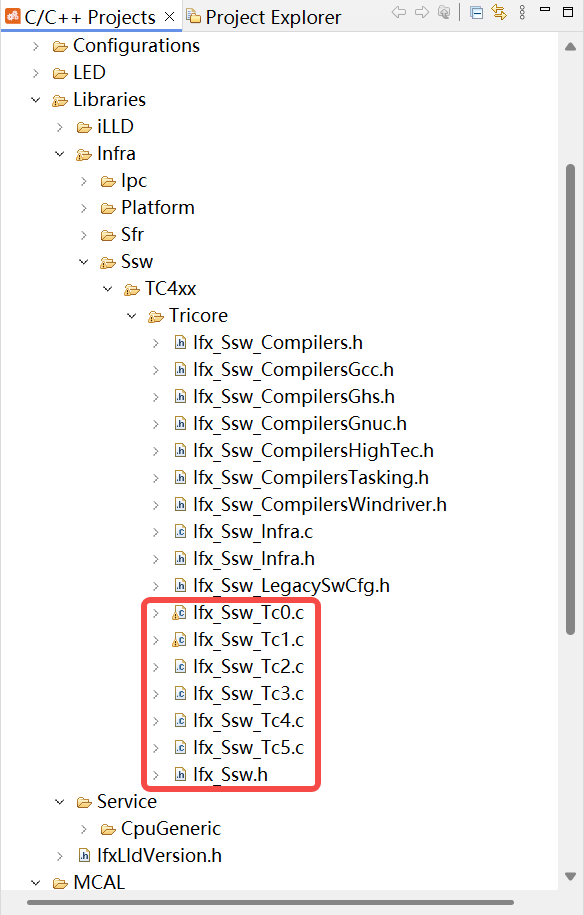

# Arc5 C 程序代码对应的架构策略说明

## 应用部署场景的变化

回归系统架构设计层面：多核同构，并行与负载均衡.
针对业务场景复杂化时选择相同控制范式策略，采用多核通信与并行，结合硬件虚拟化技术安全隔离

> 应用场景变化：“LED 系统需支持多灯效并行：① 刹车灯（最高优先级，立即响应）；② 转向灯（中等优先级，50ms 精度）；③ 氛围灯（低优先级，100ms 精度）；④ 所有灯效互不阻塞，且刹车灯可打断其他灯效”。
> 用户场景说明：此时处于转向过程中，转向灯闪烁，同时氛围灯工作（流水灯效），然后用户紧急刹车，此时系统应立即响应刹车灯， “刹车灯触发→暂停转向灯→执行刹车灯逻辑”，整个过程氛围灯保持工作，但切换到另外一个灯效模式（氛围灯同时切换为一个五个LED灯一起频闪的状态）。刹车松开后，转向灯继续呼吸、氛围灯回到流水线循环。
> 核心解决思路是 **“核心分工 + 芯片级通信 + 负载均衡”**
>
> Arc5 的核心价值（匹配需求 + 架构升级）
>
> - 实时性保障：多核拆分后，高优先级任务（如紧急关灯）独占核心资源，中断响应从 “毫秒级” 降至 “微秒级”，满足车载场景的功能安全要求（符合 AUTOSAR 功能安全等级）；
> - 并行能力释放：同构多核并行执行不同任务，灯效、外设、中断互不阻塞，支撑 “多灯效 + 多外设” 的复杂场景；
> - 硬件资源最大化利用：TC4 开发板的多核设计本就是为了车载场景的并行处理，Arc5 回归 “系统架构层”，充分发挥芯片硬件能力（而非仅在软件层解耦）；
> - 可扩展性保留：Arc41 的 “配置与业务分离” 仍被保留（如灯效配置仍通过led_cfg.c注入），同时新增 “多核任务配置”，符合架构演进的 “兼容式升级” 原则。
>
> 当需求从 “功能扩展” 升级到 “性能 / 安全 / 实时性保障” 时，架构必须从 “软件逻辑层” 回归 “系统硬件层”，这是 Arc41→Arc5 的核心驱动力。

## 同构多核软件架构设计

要在 TC499 上启用 Core1 并实现Cpu1_Main调度，需要完成多核启动配置 + Core1 代码部署 + 核间同步验证三个核心步骤

> TC499 的多核启动依赖SSW（Startup Software，启动软件） 和多核编译配置
> SSW 是 TC499 的底层启动代码（由英飞凌提供），负责初始化 CPU 核、MPU、时钟等硬件资源。
> TC499 的每个 Core 需要独立编译，生成对应 Core 的镜像文件

如截图所示：


Core1 的启动入口已定义（硬件级触发）
代码末尾的\_START1(void)函数是 Core1 的复位向量入口（绑定到.start_cpu1段），TC499 硬件复位后，Core1 会优先执行该函数：

```c
IFX_SSW_USED void \_START1(void)
{
Ifx_Ssw_Start(**USTACK1, **Core1_start); // 调用Core1的启动主函数
}
```

以上是 Core1 启动的 “硬件入口”，说明工程已为 Core1 配置了复位向量（启动的核心前提）。
\_\_Core1_start(void)函数包含 Core1 启动所需的所有硬件初始化步骤（汽车电子多核启动的必要逻辑）：

1. 配置 Core1 的陷阱向量表（CPU_BTV）、中断向量表（CPU_BIV）；
2. 启用 / 禁用 Core1 的指令 / 数据缓存（PCON0/DCON0）；
3. 初始化 Core1 的 CSA（上下文保存区）、栈指针（ISP/USTACK）；
4. 初始化 Core1 的 C 运行时环境（Ifx_Ssw_doCppInit()）；
5. 多核同步（Ifx_Ssw_MultiCore_Sync_Cpu1()）；
6. 最终调用core1_main()（Core1 的用户主函数入口）。

代码中明确声明并调用core1_main，是 Core1 执行用户逻辑的关键：

```c
#ifdef IFX_CFG_SSW_RETURN_FROM_MAIN
    extern int core1_main(void);
    int status= core1_main();        /* Call main function of CPU1 */
#else
    extern void core1_main(void);
    Ifx_Ssw_jumpToFunction(core1_main);  /* 跳转到Core1的用户主函数 */
#endif

```

只要 Core1 被编译并启动，就会自动执行编写的core1_main函数。

> 补充说明：
> 在Ifx_Ssw.h中，核心启用宏IFX_CFG_SSW_ENABLE_TRICORE1已默认定义为1U：

```c
#ifndef IFX_CFG_SSW_ENABLE_TRICORE1
#define IFX_CFG_SSW_ENABLE_TRICORE1 (1U)  // Core1启动开关默认开启
#endif
```

这是 SSW 启用 Core1 的核心宏
在Ifx_Cfg_Ssw.h中，所有可能影响 Core1 启动的配置宏，均未限制 Core1 执行：

## 引申出操作系统概念

备忘待整理内容：

> 多核系统
> 多核异构系统
> 分布式系统（多控制器、多节点）

> 隔离概念：
> 硬件资源的 “隔离与调度”，本质是 **“硬件层级→OS 层级→应用层级” 的逐层抽象与隔离 **，不同隔离技术对应不同 “抽象层级” 和 “目标场景”
> “物理硬件虚拟化→多 OS、OS Application+MPU→单 OS 多应用、Docker→单 OS 多应用”

硬件资源的隔离技术，是根据 “场景需求（实时性 / 安全性）” 选择 “抽象层级”：

1. 若要 “一个硬件跑多个 OS”（如车载中央计算平台同时运行 AUTOSAR OS 和 Linux）→ 用硬件虚拟化；
2. 若要 “一个汽车级实时 OS 内隔离安全关键功能”（如 TC499 上 LED 控制和刹车控制）→ 用 OS Application + MPU（软硬协同，保障实时 / 安全）；
3. 若要 “一个通用 OS 内隔离普通应用”（如服务器上的电商和支付程序）→ 用 Docker（纯软件，保障环境一致 / 解耦）。

> PC 上的虚拟机（如 VMware、VirtualBox），若要流畅运行两个 OS，必须依赖 CPU 的硬件虚拟化技术：
> 早期虚拟机是 “纯软件模拟”（如 QEMU 纯软件模式），但效率极低（Linux 跑在 Windows 上卡顿严重），因为软件需要 “翻译” 两个 OS 的 CPU 指令，开销巨大；
> 现在主流 PC CPU（Intel 的 VT-x、AMD 的 AMD-V）都内置了硬件虚拟化扩展，核心作用是：
>
> - 让虚拟机监控器（VMM，如 VMware 的 Hypervisor）直接调用 CPU 硬件能力，无需软件翻译指令；
> - 将物理 CPU、内存、外设抽象为 “虚拟 CPU、虚拟内存、虚拟外设”，每个虚拟机（Windows/Linux）都认为自己在独占硬件；
> - VMM 负责调度 “虚拟硬件” 对物理硬件的访问（如 Windows 用 CPU 时，Linux 暂停；反之亦然），实现 OS 间的隔离与协同。

若后续想在 TC499 上实现 “AUTOSAR OS（LED 控制）+ Linux（车载娱乐）” 共存，需依赖 TC499 的硬件虚拟化：

1. 将 LED 控制的 OS Application（非可信）绑定到 AUTOSAR OS 的 Core1，通过 MPU 隔离内存；
2. Linux 运行在 Core4，负责车载娱乐功能，无法访问 Core1 的内存 / 外设；
3. 即使 Linux 崩溃，LED 控制和其他安全关键功能仍能正常运行 —— 这正是 TC499 硬件虚拟化的核心价值，也是 PC 硬件虚拟化无法实现的（PC 上 Linux 崩溃可能导致 Windows 虚拟机卡死）。
