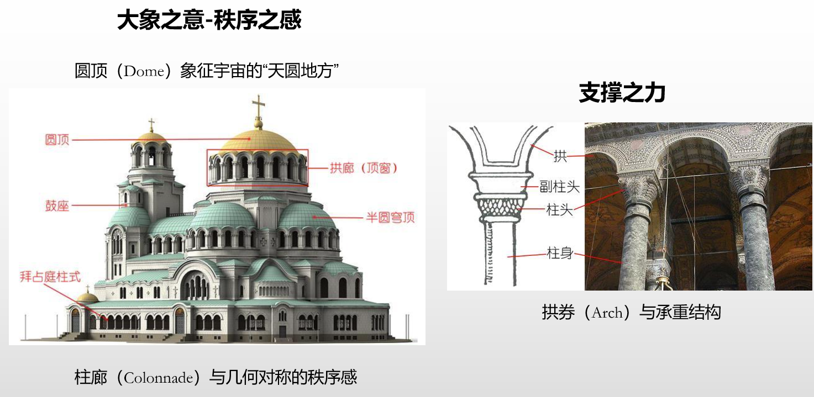

# 架构之道

- 架构是艺术（主观）和科学（映射）地对人类要应用的物体的设计或描述
- 架构是一种思想、一种能力；认识世界和在世界上共存都离不开“架构思想”

> 看得见、摸得着的事物都有“架构”
>
> 任何一次认知与决策，心中都经历了一次“架构”

思想文化

# 架构之术

# 架构演进策略

- 架构策略与软件架构设计
- 参考 AUTOSAR

1. 单体架构：分层--> 分模块 --> 抽象接口设计 --> 多核同构（芯片级通信）--> 多核异构（芯片级通信）--> 多核异构（板级通信）
2. 分布式架构：AUTOSAR VFB Concept --> AUTOSAR AP/SOA --> 微服务架构 --> 云原生架构 --> 边缘计算架构
3. 云架构：云计算架构 --> 容器架构 --> 微服务架构 --> 边缘计算架构 --> 物联网架构
4. 物联网架构：物联网架构设计 --> 物联网架构实现 --> 物联网架构管理 --> 物联网架构运营
5. 人工智能架构：机器学习架构 --> 深度学习架构 --> 强化学习架构 --> 人工智能架构管理 --> 人工智能架构运营
6. 区块链架构：共识算法 --> 共识协议 --> 共识网络 --> 区块链架构管理 --> 区块链架构运营
7. 超级计算机架构：超级计算机架构设计 --> 超级计算机架构实现 --> 超级计算机架构管理 --> 超级计算机架构运营

> 架构演进策略说明如下：
>
> | 阶段 | 对应架构策略            | 方法论                                                         | 补充说明 |
> | ---- | ----------------------- | -------------------------------------------------------------- | -------- |
> | Arc1 | 不应对变化              | copy and owned                                                 |
> | Arc2 | 向上兼容性              | 选择性条件编译--系统常数                                       |
> | Arc3 | 分层分模块              | 关注点分离，单一职责原则                                       |
> | Arc4 | 分层分模块-抽象接口设计 | SOLID 原则，抽象接口设计，依赖倒置原则，接口隔离原则，接口规范 |
