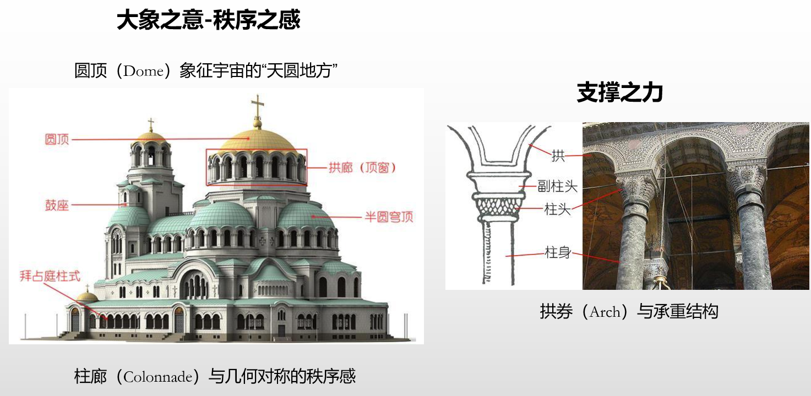
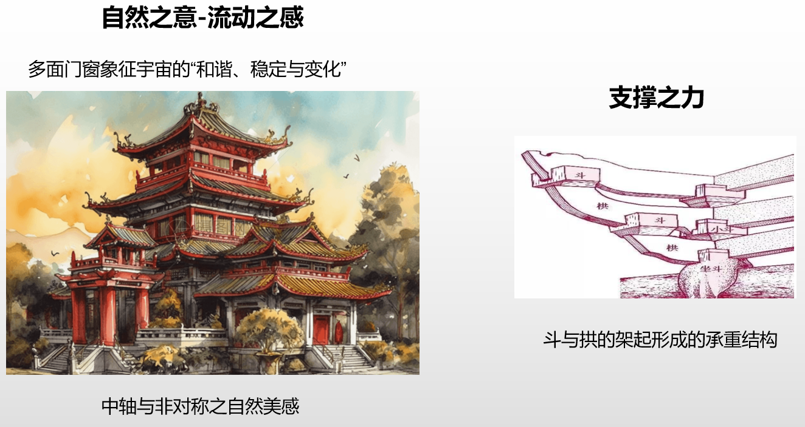
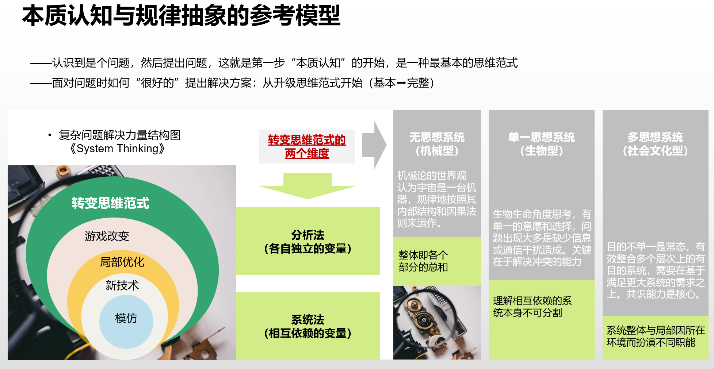

# 架构之道

- 架构是艺术（主观）和科学（映射）地对人类要应用的物体的设计或描述
- 架构是一种思想、一种能力；认识世界和在世界上共存都离不开“架构思想”

> 看得见、摸得着的事物都有“架构”
>
> 任何一次认知与决策，心中都经历了一次“架构”

思想文化

# 架构之术

# 架构演进策略

- 架构策略与软件架构设计
- 参考 AUTOSAR

1. 单体架构：分层--> 分模块 --> 抽象接口设计 --> 多核同构（芯片级通信）--> 多核异构（芯片级通信）--> 多核异构（板级通信）
2. 分布式架构：AUTOSAR VFB Concept --> AUTOSAR AP/SOA --> 微服务架构 --> 云原生架构 --> 边缘计算架构
3. 云架构：云计算架构 --> 容器架构 --> 微服务架构 --> 边缘计算架构 --> 物联网架构
4. 物联网架构：物联网架构设计 --> 物联网架构实现 --> 物联网架构管理 --> 物联网架构运营
5. 人工智能架构：机器学习架构 --> 深度学习架构 --> 强化学习架构 --> 人工智能架构管理 --> 人工智能架构运营
6. 区块链架构：共识算法 --> 共识协议 --> 共识网络 --> 区块链架构管理 --> 区块链架构运营
7. 超级计算机架构：超级计算机架构设计 --> 超级计算机架构实现 --> 超级计算机架构管理 --> 超级计算机架构运营

> 架构演进策略说明如下：
>
> | 阶段  | 对应架构策略                                             | 方法论                                                                                                                                                                                                          | 补充说明 |
> | ----- | -------------------------------------------------------- | --------------------------------------------------------------------------------------------------------------------------------------------------------------------------------------------------------------- | -------- |
> | Arc1  | 通过代码分支应对变化                                     | copy and owned                                                                                                                                                                                                  |
> | Arc2  | 通过向上兼容性设计应对变化                               | 选择性条件编译--系统常数                                                                                                                                                                                        |
> | Arc3  | 分层分模块设计                                           | 关注点分离，单一职责原则                                                                                                                                                                                        |
> | Arc4  | 分层分模块-抽象接口设计                                  | SOLID 原则，抽象接口设计，依赖倒置原则，接口隔离原则，接口规范                                                                                                                                                  |
> | Arc41 | 设计业务与配置层面的概念职责分离                         | 确保完整的实现在不改已有业务代码的情况下加新功能（进一步完整的实现开闭原则：不改业务代码仅通过配置扩展功能）                                                                                                    |
> | Arc5  | 回归系统架构设计层面：多核同构，并行与负载均衡（芯片级） | 针对业务场景复杂化时选择相同控制范式策略，采用多核通信与并行，结合硬件虚拟化技术安全隔离:从 “软件逻辑解耦” 升级到 “硬件资源调度 + 并行能力释放” ，解决 Arc41 阶段无法覆盖的 “性能瓶颈、任务阻塞、资源竞争” 问题 |
> | Arc51 | 回归系统架构设计层面：多核异构与数据驱动范式（芯片级）   | 针对业务场景复杂化时选择不同控制范式策略，采用异构通信与硬件加速技术，结合TC4 PPU处理单元                                                                                                                       |
> | Arc52 | 回归系统架构设计层面：多核异构与数据驱动范式（系统级）   | 针对业务场景复杂化时选择不同控制范式策略，采用多控制器多节点网络通信，SOA架构（AUTOSAR CP--> AP）                                                                                                               |
> | Arc6  | 升维至开发全生命周期层面：DevOps流水线范式               | 针对敏捷迭代与多人协作的业务场景，采用DevOps流水线，实现CICD自动化效率                                                                                                                                          |
> | Arc61 | 升维至开发全生命周期层面：AI Driven模型驱动范式          | 针对业务需求端的敏捷创新，采用AI驱动模型，结合AI Agent技术                                                                                                                                                      |
